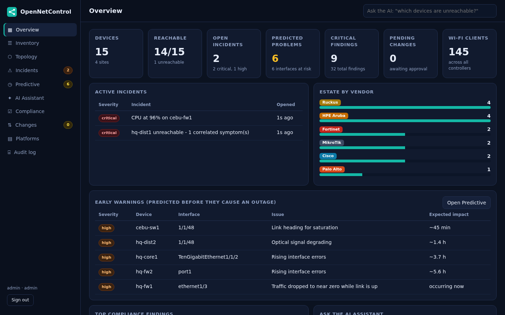
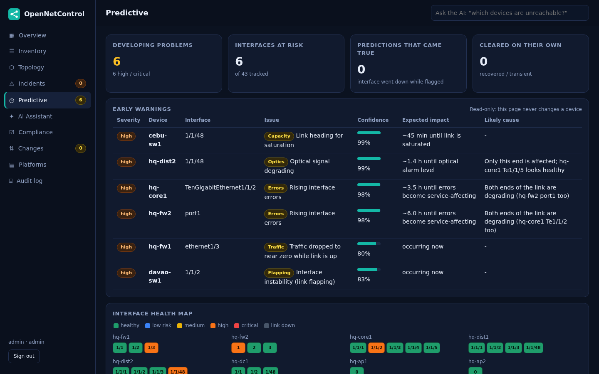
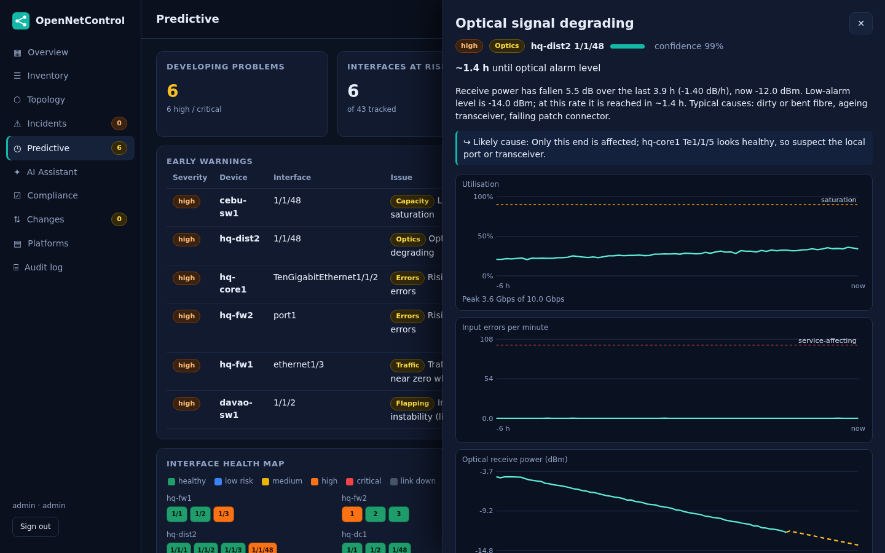
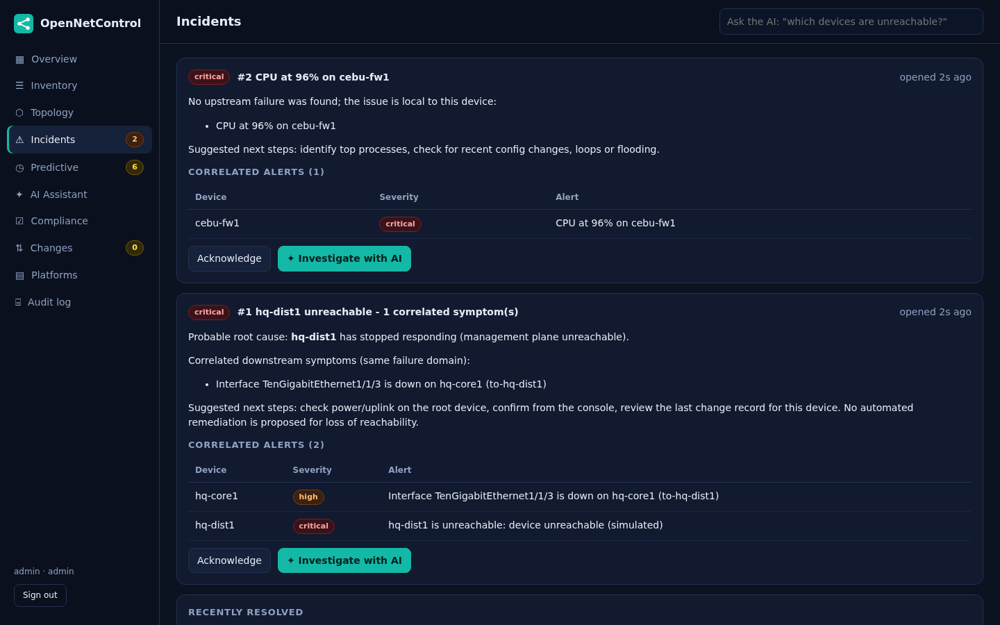
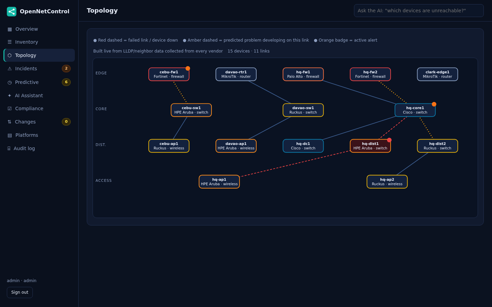
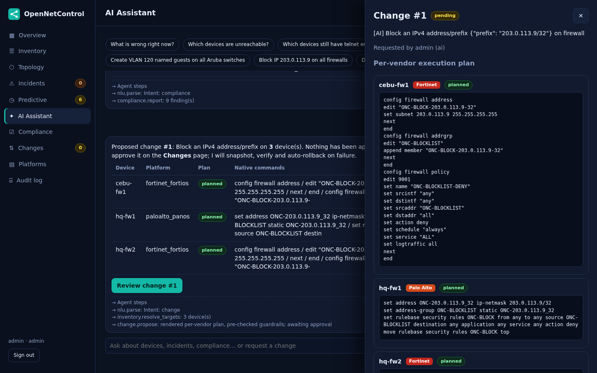
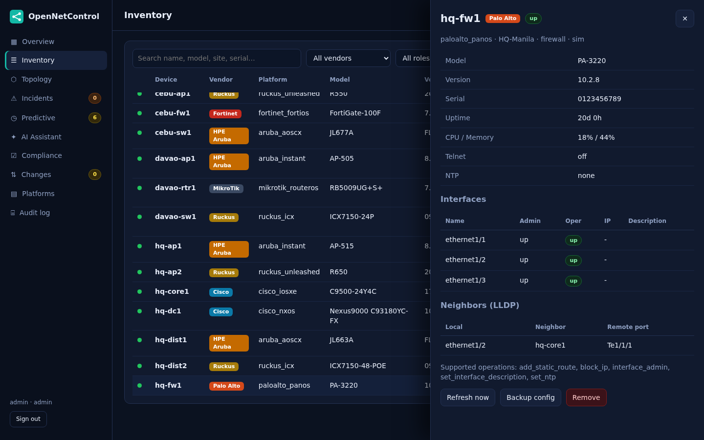
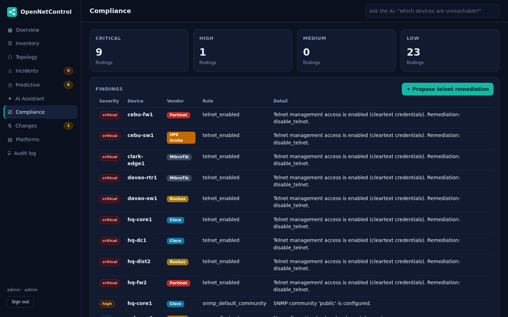
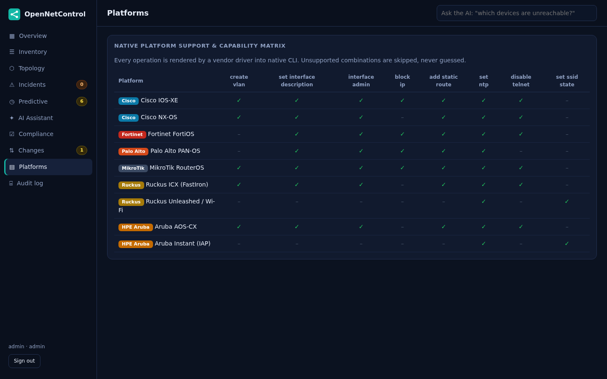

# OpenNetControl

**An open-source, AI-assisted operations platform for multi-vendor networks.**
One login, one inventory, one live topology, an AI assistant that finds the *cause* of an outage instead of
just listing symptoms, and **predictive interface monitoring that warns you before a link fails** - with human approval, automatic rollback and a tamper-evident audit trail on every change.

Natively supports **Cisco** (IOS-XE, NX-OS), **Fortinet** (FortiOS), **Palo Alto** (PAN-OS), **MikroTik** (RouterOS),
**Ruckus** (ICX switches, Unleashed Wi-Fi) and **Aruba** (AOS-CX, Instant).



## What it does

| | |
|---|---|
| **Unified inventory** | Every device from every vendor normalised into one model (platform, version, CPU/memory, interfaces, neighbours, Wi-Fi clients), searchable and filterable. |
| **Live topology** | Built from LLDP/CDP neighbour data collected from the devices themselves, drawn by tier, with failed links in red and alert badges. |
| **Predictive interface monitoring** | Learns each interface's normal behaviour and warns *before* it becomes an outage: rising errors, fading optics, capacity running out, flapping, silent traffic loss - with a forecast (ETA), confidence, evidence and likely cause (cable vs. port). Read-only. See [`docs/PREDICTIVE.md`](docs/PREDICTIVE.md). |
| **Cross-domain correlation** | Alerts that share a failure domain are folded into one incident with a probable root cause and downstream symptoms. |
| **AI assistant** | Ask in plain English ("which devices still have telnet enabled?", "block 203.0.113.9 on all firewalls"). Answers come from live data; requests become *proposed* changes. |
| **Safe change control** | Per-vendor plan preview, four-eyes approval, blast-radius cap, pre-change backup, post-change verification, all-or-nothing automatic rollback. |
| **Compliance** | Telnet, default SNMP community, missing NTP, firmware baselines, missing backups - across all vendors at once. |
| **Audit** | Hash-chained audit log; the UI can verify the chain and flags edited or deleted entries. |

### Problems predicted before they happen



### Root cause, not symptoms


### Live multi-vendor topology


### Natural-language operations, human-approved
The assistant renders the native commands for each vendor, runs them through guardrails, and then **stops**.
It has no tool that can approve or execute a change - that is enforced in code, not in a prompt.



<details><summary>More screenshots</summary>




</details>

## Install on Ubuntu Server

Tested on Debian 13 with systemd; targets Ubuntu 22.04 / 24.04 (Python 3.10+ - the test suite passes on 3.10, 3.12 and 3.13).

```bash
git clone https://github.com/mikeehendricks/OpenNetControl.git && cd OpenNetControl
sudo ./install.sh --nginx --server-name onc.example.com     # recommended: app on loopback + nginx TLS on :443
# or, plain HTTP on :8080 (lab only):
sudo ./install.sh
```

or straight from GitHub, **pinned to a release tag** (recommended over `main`):
`curl -fsSL https://raw.githubusercontent.com/mikeehendricks/OpenNetControl/v0.2.0/install.sh | sudo bash -s -- --nginx --ref v0.2.0`

The installer: installs apt packages (python3-venv, nginx if requested, ...), creates an unprivileged `opennetcontrol`
user, installs the app to `/opt/opennetcontrol` in its own virtualenv, writes `/etc/opennetcontrol/opennetcontrol.env`,
installs a sandboxed systemd service (`NoNewPrivileges`, `ProtectSystem=strict`, no capabilities), optionally configures
nginx with a self-signed certificate (replace it with a real one), starts the service and verifies `/api/health`.

* Admin password is generated on first start: `sudo cat /var/lib/opennetcontrol/initial_admin_password.txt` (change it, then delete the file).
* Re-running the script **upgrades** the code and keeps data, secrets and settings.
* Python dependencies are installed from `requirements.lock` (exact versions, SHA-256 hash-verified). `--no-lock` falls back to unpinned `requirements.txt`.
* nginx mode: TLS 1.2/1.3 with forward-secret AEAD ciphers only, request/connection rate limits, no version banner; the app runs in a heavily sandboxed systemd unit.
* Options: `--port`, `--bind`, `--nginx`, `--server-name`, `--trust-proxy`, `--demo`, `--source`, `--repo/--ref`, `--no-lock`, `--no-start`, `--skip-apt`, `-y`; see `./install.sh --help`.
* Remove: `sudo ./install.sh --uninstall` (keeps data) or `--uninstall --purge` (deletes everything).
* `--demo` runs 15 simulated devices with fault injection - never use it on a production host.

### Run without the installer (development / demo)

```bash
python -m venv .venv && . .venv/bin/activate && pip install -r requirements.txt
ONC_DEMO=1 ONC_ALLOW_SIM=1 python -m opennetcontrol      # http://localhost:8080
```

Passwords are generated on first start and written (mode 0600) to `data/initial_<user>_password.txt`
(or set `ONC_ADMIN_PASSWORD`). In demo mode the Overview page has buttons to power off a device, spike CPU or drop a link
so you can watch correlation and the AI investigation work. Docker: `docker build -t opennetcontrol . && docker run -p 8080:8080 -v onc-data:/data opennetcontrol`.

## Production notes

* Run behind TLS (`--nginx` does this). Set `ONC_TRUST_PROXY=1` **only** if your proxy sets `X-Forwarded-For`.
* Add devices (admin) via `POST /api/devices` with a stored credential; secrets are encrypted at rest (`ONC_VAULT_KEY` to supply your own key).
* Device access is SSH. Host keys are pinned on first connect and a changed key raises a critical alert.
* Back up the data directory: it contains the database, JWT key and the credential-vault key.

### Configuration (environment)

`ONC_HOST`, `ONC_PORT`, `ONC_DATA_DIR`, `ONC_ADMIN_PASSWORD`, `ONC_JWT_SECRET`, `ONC_VAULT_KEY`, `ONC_TOKEN_TTL_MIN`,
`ONC_POLL_INTERVAL`, `ONC_FOUR_EYES`, `ONC_MAX_TARGETS`, `ONC_MIN_VERSIONS`, `ONC_LOGIN_MAX_FAILS`, `ONC_LOGIN_LOCK_S`,
`ONC_LOGIN_RATE_PER_MIN`, `ONC_RATE_PER_MIN`, `ONC_TRUST_PROXY`, `ONC_TRUSTED_PROXIES`, `ONC_CORS_ORIGINS`, `ONC_LLM_URL` / `ONC_LLM_KEY` / `ONC_LLM_MODEL`, and for predictive monitoring `ONC_PREDICT`, `ONC_PREDICT_CONFIRM_S`, `ONC_PREDICT_RETENTION_H`, `ONC_PREDICT_UTIL_WARN`, `ONC_PREDICT_ERR_CRIT_PM`.

The AI works fully offline with a built-in rule-based parser. Optionally point `ONC_LLM_URL` at an OpenAI-compatible
endpoint to improve intent classification; the model only ever sees the user's question, never device output, and its
output is re-validated by the same guardrails.

## Security model

* Roles `viewer < operator < admin`; role is re-read from the database on every request.
* Bearer-token auth (no cookies, so no CSRF), pinned HS256, revocation on logout/password change, per-user/IP lockout, rate limits.
* Strict input allow-lists for every operation parameter; **no free-form CLI is ever sent to a device**.
* Policy deny-list (reload, erase, format, factory-reset, credential changes, ...) applied to every rendered line *and* its undo.
* Four-eyes approval (requester cannot approve own change), atomic execution (double-submit executes once), blast-radius cap.
* SSRF controls on device addresses, strict CSP, security headers, body-size cap, generic error responses, no API docs exposed.

See [`SECURITY.md`](SECURITY.md) to report a vulnerability, [`docs/SECURITY_AUDIT.md`](docs/SECURITY_AUDIT.md) for the third-party-tool audit, and [`docs/TEST_REPORT.md`](docs/TEST_REPORT.md) and [`docs/EXECUTIVE_REPORT.md`](docs/EXECUTIVE_REPORT.md) (v0.2.0 usability, feature, function and destructive testing) for what was tested, what was found, and what is **not** covered.

## Architecture

```
opennetcontrol/
  drivers/   one driver per platform: collect -> normalise, render(op) -> native CLI + undo, apply, verify
  sim/       faithful-enough simulators used for the demo and tests
  ai/        NLU, optional LLM classifier, agent with guardrails, predict.py (predictive engine, stdlib only)
  predictive.py  telemetry ingest, prediction lifecycle (open / clear / mute / materialize)
  core.py    inventory, polling, correlation, compliance, change workflow
  security.py  vault, auth, rate limit, hash-chained audit
  app.py     FastAPI API + static SPA
lab/         real SSH servers wrapping the simulators (used by the SSH integration tests)
tests/       unit, integration, security, fuzz, and browser (Playwright) tests
```

Adding a vendor = one driver class implementing `collect`, `render`, `apply`, `verify` plus capability flags.

## Honest status

Alpha. The drivers have been validated **against simulators and a local SSH lab, not against real hardware**.
The predictive engine's accuracy was measured on **synthetic** data only (see `docs/PREDICTIVE.md`); expect to tune it on your network.
Command syntax follows vendor documentation, but parsers must be validated against your firmware versions before
trusting them in production. Start read-only (inventory, topology, compliance) and enable changes once verified in a lab.
REST/API transports (FortiOS, PAN-OS, ...) are on the roadmap; today every vendor is driven over SSH CLI.

## Tests

```bash
pip install -r requirements-dev.txt
pytest tests --ignore=tests/e2e        # unit, integration, SSH, security, fuzz
playwright install chromium && pytest tests/e2e
python tests/e2e/shots.py http://localhost:8080   # regenerate screenshots from a running demo
```

## License

MIT
